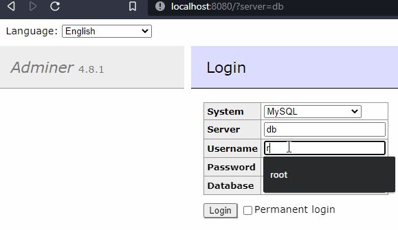
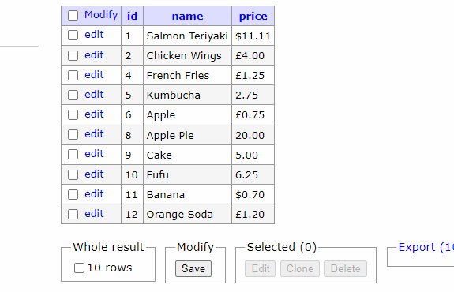

# Command Line Interface Cafe App Python Project

<p align="center">
    
</p>

## Index

* [Overview](#overview)
* [Initialisation](#initialisation)
* [Database](#database)
* [Features](#features) 
* [Conclusion](#conclusion)

## Overview

A Cafe app that uses the command line interface for python3.<br />  Using python code to natively view, create, update and remove from the products, courier and order tables. <br /> Integration with Docker using containers such as 'Adminer' for providing the database and MYSQL for management of the data.

## Initialisation

- Start by creating and running a virtual environment: <br />
python3 -m venv .venv <br />
...
- Install required packages: <br />
pip install -r requirements.txt <br />
- Run Docker for MYSQL Database: <br />
docker-compose up -d <br />
- Connect to Adminer by the following link: Select the MiniProject tab:
```sh 
http://localhost:8080/ 
```
- Input the username and password to login. <br />

<p align="center">
    
</p>

- Run the Saucy app in the \saucy folder: <br />
py app.py 

## Database

With Adminer the changes are made instantly in realtime to the database through the backend without having to close the app. Through the frontend, we can see the change to the database reflected upon site refresh. <br />
For example: we can see the functionality work below, when creating a new "Coconut" product.

<p align="center">
    
</p>

This extends to all additional functions such as update and delete.

## Features 

Tradionally Python's CLI Terminals do not come with visual aid so I used packages installed from NPM to supplement the UI aspect of the front end. With the use of packages, I was able to utitlise colours, Menu ASCII Art, loading bars, tables and cowsay features to give an element of interactivity to a CLI app.

<p align="center">
    
</p>

I was also able to take this a step further. With the back-end of the App having error exceptions in mind for inputs, I was also able to colour code for exceptions to print in red, while successful entries printed in green.

For example: 
```
....
    execute_query(sql)

    bars.loading_info(info='Adding Product to Database Entry.')
    function.clear_screen()
    print(Fore.GREEN + f'{name} with a price of {price} has been added to the Database.')
except Exception as e:
    function.clear_screen()
    bars.loading_info(info='Processing')
    print(Fore.RED + "Restarting. Error:" + str(e))
break   

```

We can see the outcome of a wrong input below in red, alongside the error type printed.

<p align="center">
    
</p>

## Conclusion

The project originally included reading and writing to .CSV where the app relied solely on python coding for earlier versions. <br />
[Can be found in "function.py"]. <br />
As the Project scope changed towards the final objective using a MYSQL Database, so did the code. <br />
This App was an independent project that we presented to our cohorts and mentors upon reaching the deadline to demonstrate our abilities with Python3.   


